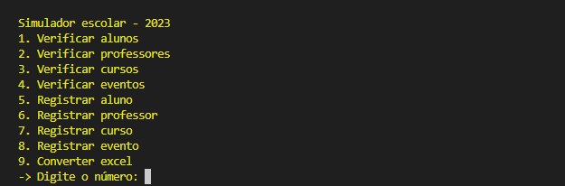

# SIMULADOR ESCOLAR | Clube robótica 2023

Simulador escolar 2023 é um projeto feito em python, ele pode ser usado para base para programas/sites que gerenciam escolas (ou até mesmo outro nicho). *Veja mais informações no pdf do projeto [clicando aqui](apresentação/Introdução_autobots.pdf).*

# Aviso

Este projeto não foi planejado/programado para ser algo profissional, então usaremos um banco de dados local e um simples painel dashboard.

# Tecnologias

- SQL - Banco de dados (Irá armazenar os dados escolares). (SQlite3)
- Python - Linguagem de programação

# Desafio para programadores.

- No registro, verifique se o id escolha (id para cursos, professores e alunos) já existe, caso existir, gere outro.
